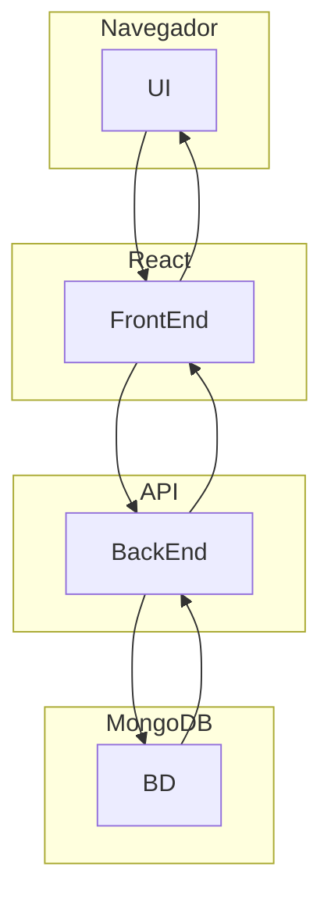
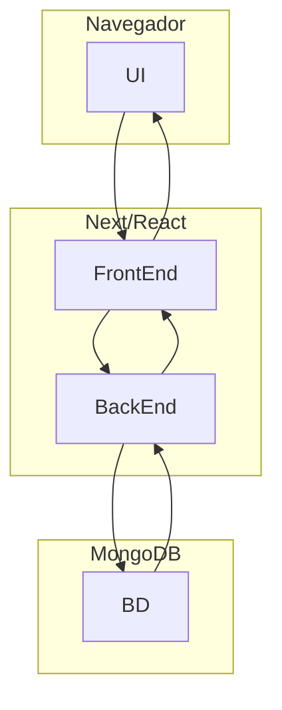

## Curso FrontEnd - Prof Diogo 

## Manipulação de MongoDB

use minhaLojaSESIB;

db.produtos.insertOne(
    {
        nome: "SmartPhone",
        marca: "Xiaomi",
        valor: 1200.00,
        quantidade: 12,
        especificacoes:{
            modelo: "Gamer",
            processador: "Octa-Core 2GH",
            ram: "8GB",
            armazenamento: "128GB"
        },
        corer: ["cinza","preto","amarelo","azul","rosa"]
    }
);

db.produtos.find();

db.produtos.find({valor:{$gt:1000}});

db.produtos.find({quantidade:{$lt:20}})

## Criando um Diagrama com Mermaid

### Diagrama de Fluxo de Arquitetura de Projeto

### Diagrama de Fluxo de Arquitetura para um Projeto Next

