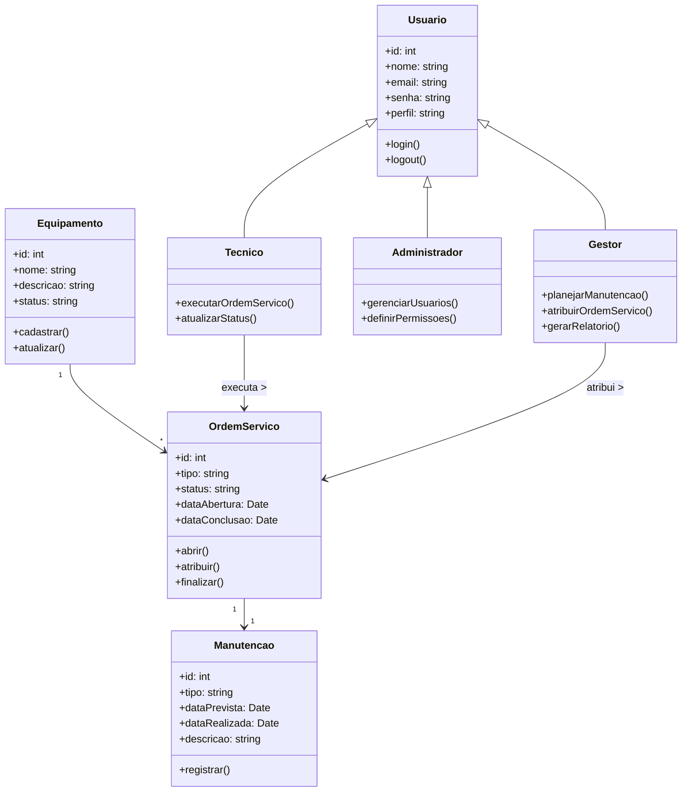
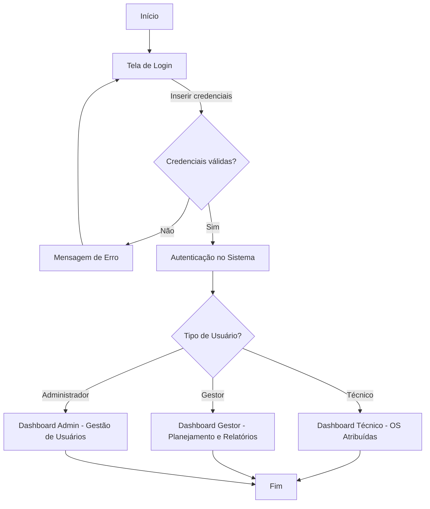

# Sistema de Gestão de Manutenções ( Formativa ) 


## Briefing 


## Escopo 

- Objetivos :

- Público-Alvo: 

- Recursos Tecnológicos: 


## Diagramas (Mermaid, Miro, Draw.io, e etc) 

### - Diagrama de Classe : 

 


### - Diagrama de Fluxo : 



### - Diagrama de Casos de Uso : 
```mermaid
graph TD
    subgraph Sistema de Gestão de Manutenção (SGM)
        uc1("Fazer Login")
        uc2("Gerenciar Equipamentos (CRUD)")
        uc3("Gerenciar Ordens de Serviço (CRUD)")
        uc4("Visualizar Dashboard")
        uc5("Gerenciar Usuários")
    end

    actor "Técnico de Manutenção" as Tecnico
    actor "Gestor de Manutenção" as Gestor
    actor "Administrador" as Admin

    Tecnico -- uc1
    Tecnico -- uc3
    Tecnico -- uc4

    Gestor -- uc1
    Gestor -- uc2
    Gestor -- uc3
    Gestor -- uc4

    Admin -- uc5
    Admin -- Gestor

    uc3 --|> uc1 : include
    uc2 --|> uc1 : include
    uc4 --|> uc1 : include
    uc5 --|> uc1 : include

```


## Análise de Risco 


## Prototipagem 


## Codificação 